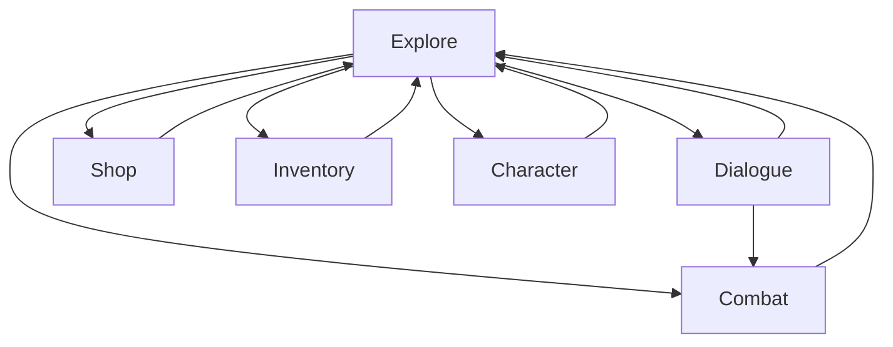

# Dungeon
A simple top-down 2D adventure/RPG game made using a TDD approach.

## Player characters

## NPCs

## Combat

## Inventory and Items

## Game mechanics
The game cycles through the following states:
|Game State|Description|
|---|---|
|Explore|The initial state of the game where the party moves around the map.|
|Dialogue|The party engages in dialogue with an NPC.|
|Combat|The party fights a group of monsters.|
|Shop|For buying and selling items from vendors.|
|Inventory|For inventory management and picking up items.|
|Character|For player character management.|

