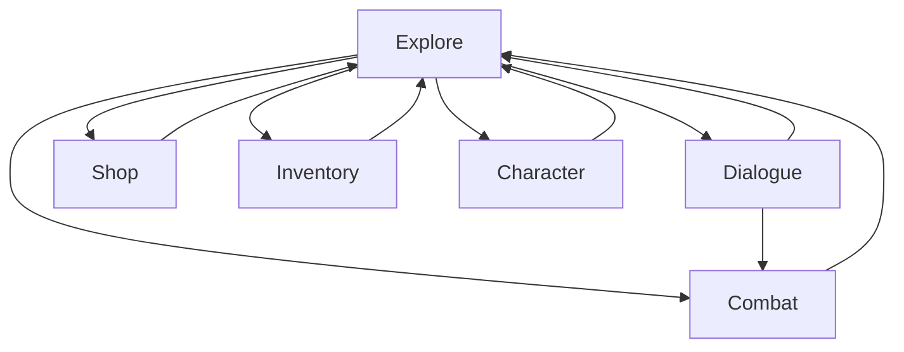

# Dungeon
A simple top-down 2D adventure/RPG game made using a TDD approach.
Character/gameplay rules based on GURPS 4e.

> Only the parts of the original rules that are actually useful for the game will be implemented!

## Player characters

### Primary Attributes

|Attribute|Short|Description|Combat Effect|Dialogue Effect|Auxiliary Effect|
|---|---|---|---|---|---|
|Strength|ST|...|Melee Damage|Threats|Heavier weapons and armor|
|Dexterity|DX|...|Chance to hit/dodge|...|...|
|Intelligence|IQ|...|Spell Damage|Cleverness|More difficult spells|
|Health|HT|...|Fatigue used for stronger attacks, health used to asbsorb damage|...|More life/fatigue points|

### Secondary Characteristics

- Damage (Dmg): Determines the basic damage for melee weapons and unarmed combat. 
- Basic Lift (BL): Encumberance, directly affects combat.
- Hit Points (HP): Directly affects combat.
- Will
- Perception (Per)
- Fatigue Points (FP)
- Basic Speed
- Basic Move
- *Build: Cosmetic only, may be mentioned in the description or shown in the art but has no impact on the gameplay directly, will not implement.*
- Size Modifier

## NPCs

## Combat

## Inventory and Items

## Game mechanics

The game cycles through the following states:
|Game State|Description|
|---|---|
|Explore|The initial state of the game where the party moves around the map.|
|Dialogue|The party engages in dialogue with an NPC.|
|Combat|The party fights a group of monsters.|
|Shop|For buying and selling items from vendors.|
|Inventory|For inventory management and picking up items.|
|Character|For player character management.|

### Dialogue

Dialogue traverses through individual states, each state consists of a text and a list of options.
Each option can have a condition that determines if it is shown to the player (and therefore choosable by the player).
Each option can have actions attached to it, which will be executed before traversing to the next dialogue state.  
[Details](dialogue.md)
