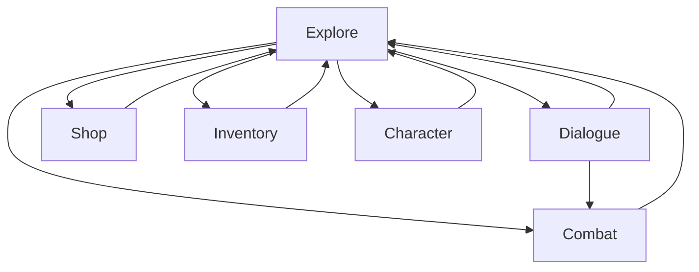

# Dungeon

A simple top-down 2D adventure/RPG game made using a TDD approach.
Character/gameplay rules based on GURPS 4e.

> Only the parts of the original rules that are actually useful for the game will be implemented!

## General Game Progression
1. [Character creation](characterCreation.md)
1. Introduction to the story
    1. Combat
    1. Dialog
    1. Exploring the environment
1. Acquiring first quests
1. Discovering new interactions
1. Shopping
1. Gaining XP
1. Gaining Levels
1. Using special skills
1. Puzzle/minigames/whatever
1. Gaining new party members
1. Map travelling

## Player characters

### Primary Attributes

|Attribute|Short|Description|Combat Effect|Dialogue Effect|Auxiliary Effect|
|---|---|---|---|---|---|
|Strength|ST|...|Melee Damage|Threats|Heavier weapons and armor|
|Dexterity|DX|...|Chance to hit/dodge|...|...|
|Intelligence|IQ|...|Spell Damage|Cleverness|More difficult spells|
|Health|HT|...|Fatigue used for stronger attacks, health used to asbsorb damage|...|More life/fatigue points|

### Secondary Characteristics

- Damage (Dmg): Determines the basic damage for melee weapons and unarmed combat. 
- Basic Lift (BL): Encumberance, directly affects combat.
- Hit Points (HP): Directly affects combat.
- Will
- Perception (Per)
- Fatigue Points (FP)
- *Basic Speed: Will be displayed to the user, but the user is not able to modify this value.*
- *Basic Move: Will be displayed to the user, but the user is not able to modify this value.*
- *Build: Cosmetic only, may be mentioned in the description or shown in the art but has no impact on the gameplay directly, will not implement.*
- *Size Modifier: Affects chance to hit, will implement as a part of the racial templates but user will not be able to directly affect it.*

### Advantages and Disadvantages

### Skills

### Spells

### Reaction Modifiers

[Details](playercharacters.md)

## Game mechanics

The game cycles through the following states:
|Game State|Description|
|---|---|
|Explore|The initial state of the game where the party moves around the map.|
|Dialogue|The party engages in dialogue with an NPC.|
|Combat|The party fights a group of monsters.|
|Shop|For buying and selling items from vendors.|
|Inventory|For inventory management and picking up items.|
|Character|For player character management.|

### Character Progression

Characters get experience points (XP) for completing quests and proceeding through the game. This may include killing some NPCs/Monsters, but no XP is given for just killing opponents.
[Details](progression.md)

### Dialogue

Dialogue traverses through individual states, each state consists of a text and a list of options.
Each option can have a condition that determines if it is shown to the player (and therefore choosable by the player).
Each option can have actions attached to it, which will be executed before traversing to the next dialogue state.  
[Details](dialogue.md)

## NPCs

## Combat

## Inventory and Items

Some of the items, such as weapons have a minimum ST requirement. In GURPS, this means the character without the required ST will receive a skill penalty using the weapon and spends fatigue at the end of each prolonged combat. It might be convenient to implement the minimum ST requirement in the more common way which prevents the character from wielding the weapon at all if they don't have the required amount of ST.

Unlike weapons, armor does not have a minimum ST requirement, but the heavier armor obviously encumbers the character more. And characters with lower amount of ST become encumbered easier.
