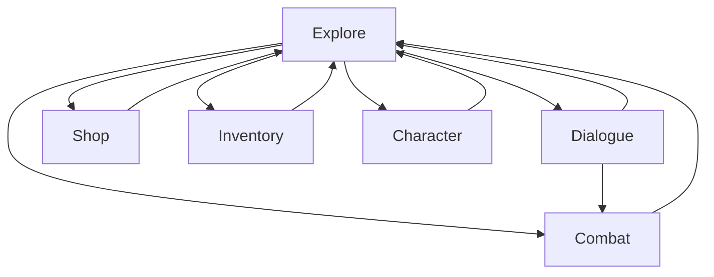

# Dungeon

A simple top-down 2D adventure/RPG game made using a TDD approach.
Character/gameplay rules based on GURPS 4e.

> Only the parts of the original rules that are actually useful for the game will be implemented!

## General Game Progression
1. [Character creation](Docs/characterCreation.md)
1. [Introduction to the story](Docs/introductionToTheStory.md)
1. Exploring the environment
    1. Combat
    1. [Dialogue](Docs/dialogue.md)
1. Acquiring first quests
1. Discovering new interactions
1. Shopping
1. Gaining XP
1. Gaining Levels
1. Using special skills
1. Puzzle/minigames/whatever
1. Gaining new party members
1. Map travelling

## Game mechanics

The game cycles through the following states:
|Game State|Description|
|---|---|
|Explore|The initial state of the game where the party moves around the map.|
|Dialogue|The party engages in dialogue with an NPC.|
|Combat|The party fights a group of monsters.|
|Shop|For buying and selling items from vendors.|
|Inventory|For inventory management and picking up items.|
|Character|For player character management.|

### Character Progression

Characters get experience points (XP) for completing quests and proceeding through the game. This may include killing some NPCs/Monsters, but no XP is given for just killing opponents.
[Details](progression.md)

## NPCs

## Combat

## Inventory and Items

Some of the items, such as weapons have a minimum ST requirement. In GURPS, this means the character without the required ST will receive a skill penalty using the weapon and spends fatigue at the end of each prolonged combat. It might be convenient to implement the minimum ST requirement in the more common way which prevents the character from wielding the weapon at all if they don't have the required amount of ST.

Unlike weapons, armor does not have a minimum ST requirement, but the heavier armor obviously encumbers the character more. And characters with lower amount of ST become encumbered easier.
